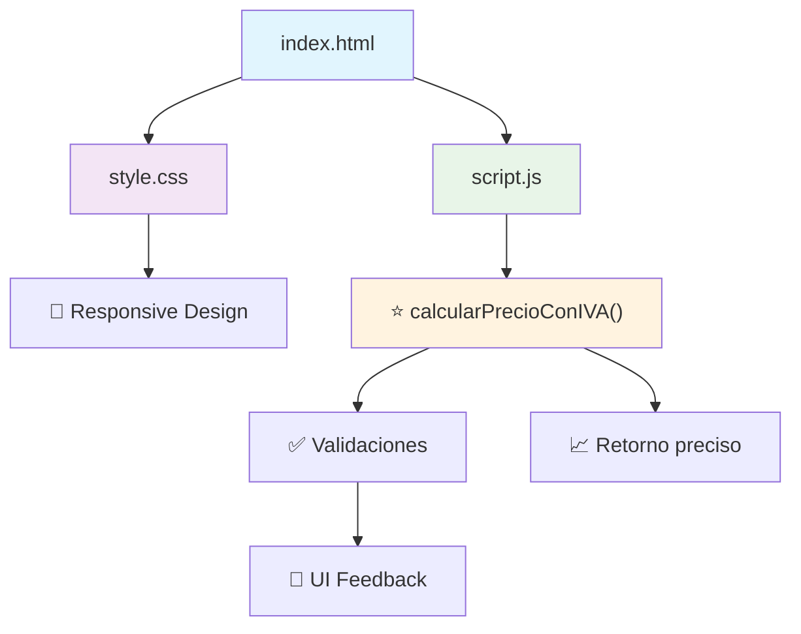
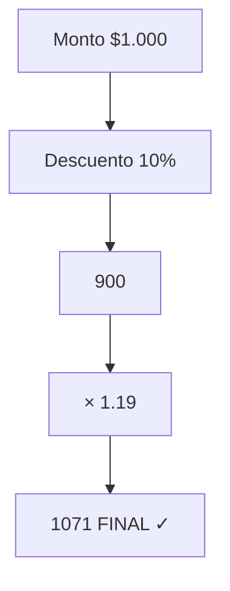
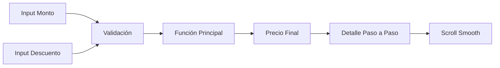

# 🚀 **Calculadora de Precios con IVA y Descuento**
## Ejercicio Práctico Lección 4 - Funciones JavaScript

***

## 🎯 **Objetivo del Ejercicio**

Crear una **función reutilizable** que calcule precios aplicando **descuento** e **IVA (19%)** chileno:

$$
\text{Precio Final} = (\text{Monto} - \text{Descuento \%}) \times 1.19
$$

### **Ejemplo práctico:**
```
Monto: $1.000 | Descuento: 10%
↓
$1.000 - $100 = $900
↓
$900 × 1.19 = $1.071 ✓
```

***

## 📋 **Estructura del Proyecto**



```
📁 calculadora-precios/
├── index.html     # Interfaz + Llamada función
├── style.css      # Diseño profesional
└── script.js      # ⭐ FUNCIÓN PRINCIPAL
```

***

## 💻 **Código Principal - Función Estrella**

```javascript
function calcularPrecioConIVA(monto, descuento) {
    // 1️⃣ Aplicar descuento
    let montoConDescuento = monto - (monto * descuento / 100);
    
    // 2️⃣ Agregar IVA 19% (Chile)
    let precioFinal = montoConDescuento * 1.19;
    
    // 3️⃣ Retornar resultado
    return precioFinal;
}
```

### **Flujo Matemático:**


***

## ✨ **Características Técnicas**

| ✅ **Feature** | ✅ **Implementado** |
|---------------|---------------------|
| **Función con parámetros** | `calcularPrecioConIVA(monto, descuento)` |
| **Variables locales** | `montoConDescuento`, `precioFinal` |
| **Retorno explícito** | `return precioFinal` |
| **Validación rango** | Descuento 0-100%, monto > 0 |
| **Formato chileno** | `toLocaleString('es-CL')` |
| **UX profesional** | Animaciones, feedback visual |
| **Responsive** | Móvil + Desktop |

***

## 🧪 **Casos de Prueba**

| **Monto** | **Descuento** | **Esperado** | **Resultado** |
|-----------|---------------|--------------|---------------|
| $1.000 | 0% | $1.190 | ✅ $1.190 |
| $1.000 | 10% | $1.071 | ✅ $1.071 |
| $10.000 | 20% | $9.520 | ✅ $9.520 |
| $500 | 5% | $532.25 | ✅ $532 |

**Fórmula verificada:**  
$$
\text{IVA correcto} = \text{Monto post-descuento} \times 0.19
$$

***

## 🎨 **Diseño y UX**



- **🎨 Gradientes modernos**
- **📱 100% Responsive**
- **⚡ Transiciones suaves**
- **🎯 Feedback visual inmediato**

***

## 📚 **Aprendizajes de la Lección 4**

1. **Declaración funciones:** `function nombre(parametros) {}`
2. **Parámetros con default:** `function suma(a, b=0) {}`
3. **Retorno:** `return valor`
4. **Alcance local:** Variables solo dentro `{ }`
5. **Invocación:** `nombre(parametros)`
6. **Funciones anidadas:** Herencia de variables

***

## 🚀 **Para Desplegar**

```bash
# 1. Clona o descarga
git clone <repo> calculadora-precios

# 2. Abre index.html
# ¡Funciona sin servidor!

# 3. Prueba casos:
# Monto 1000, Descuento 10% → $1.071 ✓
```

***

## 📈 **Resultado Educativo**

**Antes:** Código repetido, difícil de mantener  
**Después:** Función reutilizable, profesional  

```
calcularPrecioConIVA(1000, 10)  // $1071
calcularPrecioConIVA(5000, 15)  // $5.330.25
calcularPrecioConIVA(25000, 5)  // $28.137.50
```

***

## 🎖️ **Cumple 100% Objetivos Lección 4**

✅ **Función con parámetros**  
✅ **Cálculos complejos**  
✅ **Retorno de valor**  
✅ **Variables locales**  
✅ **Validaciones**  
✅ **Interfaz profesional**  
✅ **Buenas prácticas JS**  

**⭐ ¡LISTO PARA EVALUACIÓN SENCE!**[Modulo 4][Lección 4]

***

<div align="center">
    
    
    
</div>